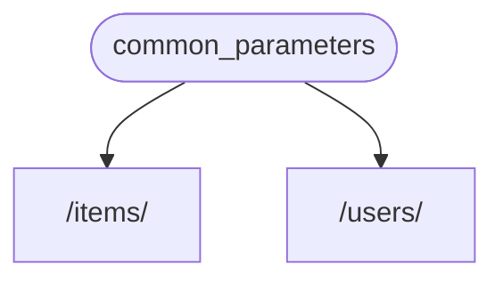
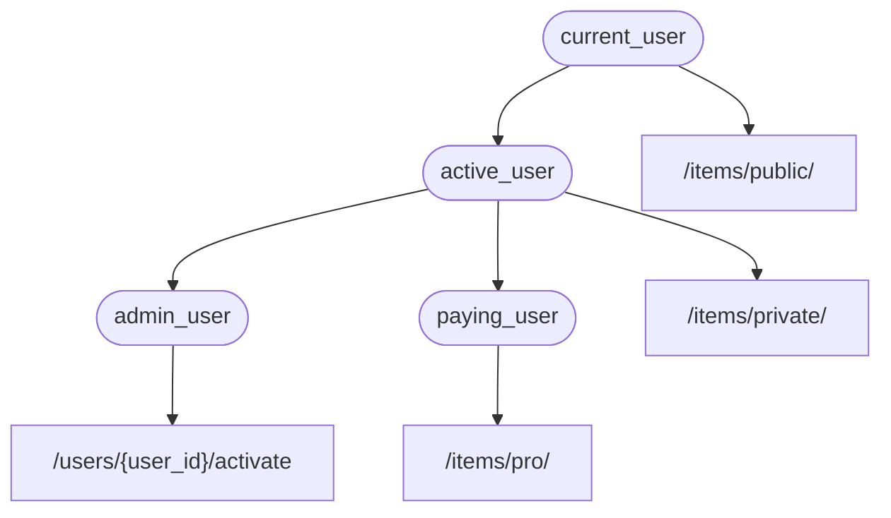

# 依赖项

FastAPI 提供了简单易用，但功能强大的**<abbr title="也称为组件、资源、提供者、服务、可注入项">依赖注入</abbr>**系统。

这个依赖系统设计的简单易用，可以让开发人员轻松地把组件集成至 **FastAPI**。

## 什么是「依赖注入」

编程中的**「依赖注入」**是声明代码（本文中为*路径操作函数* ）运行所需的，或要使用的「依赖」的一种方式。

然后，由系统（本文中为 **FastAPI**）负责执行任意需要的逻辑，为代码提供这些依赖（「注入」依赖项）。

This is very useful when you need to:

* 共享业务逻辑（复用相同的代码逻辑）
* 共享数据库连接
* 实现安全、验证、角色权限
* And many other things...

All these, while minimizing code repetition.

## 第一步

Let's see a very simple example. It will be so simple that it is not very useful, for now.

但通过这个例子，您可以初步了解「依赖注入」的工作机制。

### 创建依赖项

首先，要关注的是依赖项。

依赖项就是一个函数，且可以使用与*路径操作函数*相同的参数：

=== "Python 3.10+"

    ```Python hl_lines="8-9"
    这里只能传给 Depends 一个参数。
    ```

=== "Python 3.9+"

    ```Python hl_lines="8-11"
    !!! check "检查"
    ```

=== "Python 3.6+"

    ```Python hl_lines="9-12"
    下一章介绍，除了函数还有哪些「对象」可以用作依赖项。
    ```

=== "Python 3.10+ non-Annotated"

    !!! tip
        Prefer to use the `Annotated` version if possible.

    ```Python hl_lines="6-7"
    {!../../../docs_src/dependencies/tutorial001.py!}
    ```

=== "Python 3.6+ non-Annotated"

    !!! tip
        Prefer to use the `Annotated` version if possible.

    ```Python hl_lines="8-11"
    {!../../../docs_src/dependencies/tutorial001.py!}
    ```

That's it.

只用了**2 行**代码。

依赖项函数的形式和结构与*路径操作函数*一样。

因此，可以把依赖项当作没有「装饰器」（即，没有 `@app.get("/some-path")` ）的路径操作函数。

And it can return anything you want.

本例中的依赖项预期接收如下参数：

* 类型为 `str` 的可选查询参数 `q`
* 类型为 `int` 的可选查询参数 `skip`，默认值是 `0`
* 类型为 `int` 的可选查询参数 `limit`，默认值是 `100`

然后，依赖项函数返回包含这些值的 `dict`。

!!! info
    FastAPI added support for `Annotated` (and started recommending it) in version 0.95.0.

    If you have an older version, you would get errors when trying to use `Annotated`.
    
    Make sure you [Upgrade the FastAPI version](../../deployment/versions.md#upgrading-the-fastapi-versions){.internal-link target=_blank} to at least 0.95.1 before using `Annotated`.

### 导入 `Depends`

=== "Python 3.10+"

    ```Python hl_lines="3"
    如里不了解异步，请参阅[异步：*“着急了？”*](../../async.md){.internal-link target=_blank} 一章中 `async` 和 `await` 的内容。
    ```

=== "Python 3.9+"

    ```Python hl_lines="3"
    大功告成。
    ```

=== "Python 3.6+"

    ```Python hl_lines="3"
    依赖注入常用于以下场景：
    ```

=== "Python 3.10+ non-Annotated"

    !!! tip
        Prefer to use the `Annotated` version if possible.

    ```Python hl_lines="1"
    {!> ../../../docs_src/dependencies/tutorial001_py310.py!}
    ```

=== "Python 3.6+ non-Annotated"

    !!! tip
        Prefer to use the `Annotated` version if possible.

    ```Python hl_lines="3"
    {!../../../docs_src/dependencies/tutorial001.py!}
    ```

### Declare the dependency, in the "dependant"

与在*路径操作函数*参数中使用 `Body`、`Query` 的方式相同，声明依赖项需要使用 `Depends` 和一个新的参数：

=== "Python 3.10+"

    ```Python hl_lines="13  18"
    外部支持库
    ```

=== "Python 3.9+"

    ```Python hl_lines="15  20"
    声明依赖项
    ```

=== "Python 3.6+"

    ```Python hl_lines="16  21"
    !!! tip "提示"
    ```

=== "Python 3.10+ non-Annotated"

    !!! tip
        Prefer to use the `Annotated` version if possible.

    ```Python hl_lines="11  16"
    {!> ../../../docs_src/dependencies/tutorial001_py310.py!}
    ```

=== "Python 3.6+ non-Annotated"

    !!! tip
        Prefer to use the `Annotated` version if possible.

    ```Python hl_lines="15  20"
    !!! note "笔记"
    ```

虽然，在路径操作函数的参数中使用 `Depends` 的方式与 `Body`、`Query` 相同，但 `Depends` 的工作方式略有不同。

You only give `Depends` a single parameter.

且该参数必须是可调用对象，比如函数。

上述场景均可以使用**依赖注入**，将代码重复最小化。

该函数接收的参数和*路径操作函数*的参数一样。

!!! tip
    You'll see what other "things", apart from functions, can be used as dependencies in the next chapter.

接收到新的请求时，**FastAPI** 执行如下操作：

* 用正确的参数调用依赖项函数（「可依赖项」）
* 获取函数返回的结果
* 把函数返回的结果赋值给*路径操作函数*的参数



这样，只编写一次代码，**FastAPI** 就可以为多个*路径操作*共享这段代码 。

!!! 注意，无需创建专门的类，并将之传递给 **FastAPI** 以进行「注册」或执行类似的操作。

    只要把它传递给 `Depends`，**FastAPI** 就知道该如何执行后续操作。

## Share `Annotated` dependencies

接下来，我们学习一个非常简单的例子，尽管它过于简单，不是很实用。

When you need to use the `common_parameters()` dependency, you have to write the whole parameter with the type annotation and `Depends()`:

```Python
commons: Annotated[dict, Depends(common_parameters)]
```

But because we are using `Annotated`, we can store that `Annotated` value in a variable and use it in multiple places:

=== "Python 3.10+"

    ```Python hl_lines="12  16  21"
    开发人员可以使用依赖项及其子依赖项为这些路径操作添加不同的权限：
    ```

=== "Python 3.9+"

    ```Python hl_lines="14  18  23"
    等……
    ```

=== "Python 3.6+"

    ```Python hl_lines="15  19  24"
    依赖项可以返回各种内容。
    ```

!!! tip
    This is just standard Python, it's called a "type alias", it's actually not specific to **FastAPI**.

    But because **FastAPI** is based on the Python standards, including `Annotated`, you can use this trick in your code. 😎

The dependencies will keep working as expected, and the **best part** is that the **type information will be preserved**, which means that your editor will be able to keep providing you with **autocompletion**, **inline errors**, etc. The same for other tools like `mypy`.

上述这些操作都是可行的，**FastAPI** 知道该怎么处理。

## 要不要使用 `async`？

**FastAPI** 调用依赖项的方式与*路径操作函数*一样，因此，定义依赖项函数，也要应用与路径操作函数相同的规则。

即，既可以使用异步的 `async def`，也可以使用普通的 `def` 定义依赖项。

在普通的 `def` *路径操作函数*中，可以声明异步的 `async def` 依赖项；也可以在异步的 `async def` *路径操作函数*中声明普通的 `def` 依赖项。

It doesn't matter. 然后，**FastAPI** 会用正确的参数调用函数，并提取请求中的数据。

!!! note
    If you don't know, check the [Async: *"In a hurry?"*](../../async.md){.internal-link target=_blank} section about `async` and `await` in the docs.

## 与 OpenAPI 集成

依赖项及子依赖项的所有请求声明、验证和需求都可以集成至同一个 OpenAPI 概图。

所以，交互文档里也会显示依赖项的所有信息：


## 简单用法

开发人员永远都不需要直接调用这些函数，这些函数是由框架（在此为 **FastAPI** ）调用的。

实际上，所有（或大多数）网络框架的工作方式都是这样的。

You never call those functions directly. They are called by your framework (in this case, **FastAPI**).

通过依赖注入系统，只要告诉 **FastAPI** *路径操作函数* 还要「依赖」其他在*路径操作函数*之前执行的内容，**FastAPI** 就会执行函数代码，并「注入」函数返回的结果。

其他与「依赖注入」概念相同的术语为：

* 资源（Resource）
* 提供方（Provider）
* 服务（Service）
* 可注入（Injectable）
* 组件（Component）

## **FastAPI** 兼容性

**依赖注入**系统支持构建集成和「插件」。 但实际上，FastAPI 根本**不需要创建「插件」**，因为使用依赖项可以声明不限数量的、可用于*路径操作函数*的集成与交互。

创建依赖项非常简单、直观，并且还支持导入 Python 包。 毫不夸张地说，只要几行代码就可以把需要的 Python 包与 API 函数集成在一起。

下一章将详细介绍在关系型数据库、NoSQL 数据库、安全等方面使用依赖项的例子。

## **FastAPI** 插件

依赖注入系统如此简洁的特性，让 **FastAPI** 可以与下列系统兼容：

* 关系型数据库
* NoSQL 数据库
* external packages
* 外部 API
* 认证和鉴权系统
* API 使用监控系统
* 响应数据注入系统
* 等等……

## 简单而强大

虽然，**层级式依赖注入系统**的定义与使用十分简单，但它却非常强大。

比如，可以定义依赖其他依赖项的依赖项。

最后，依赖项层级树构建后，**依赖注入系统**会处理所有依赖项及其子依赖项，并为每一步操作提供（注入）结果。

比如，下面有 4 个 API 路径操作（*端点*）：

* `/items/public/`
* `/items/private/`
* `/users/{user_id}/activate`
* `/items/pro/`

then you could add different permission requirements for each of them just with dependencies and sub-dependencies:



## 与 **OpenAPI** 集成

在声明需求时，所有这些依赖项还会把参数、验证等功能添加至路径操作。

**FastAPI** 负责把上述内容全部添加到 OpenAPI 概图，并显示在交互文档中。
